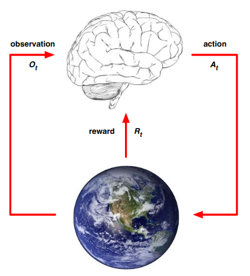
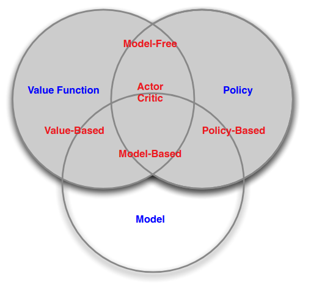

# RL-Sutton-Barto-Notes

- The terms supervised and unsupervised learning would seem to exhaustively classify machine learning paradigms, except they do not. 
- Policy: A policy is a mapping from perceived states of the environment to actions to be taken when in those states. 
- Reward: A reward signal defines the goal of a reinforcement learning problem. 
- Reward: The reward signal is the primary basis for altering the policy 
- Value function: The value of a state is the total amount of reward an agent can expect to accumulate over the future, starting from that state. 
- Reward vs Value: Rewards are in a sense primary, whereas values, as predictions of rewards, are secondary.
- Model: Model is agent's representation of the environment
  - Transitions: Predicts the next state
  - Rewards: Predicts the next (immediate) reward
- History: The history is a sequence of observation, actions, rewards
- RL is different from planning problem. In planning, the environment rules are known and the agent decision can be based on look-ahead or search   

- State: Formally, a state is a function of history 
- The environment state is the environment's private state and is usually not visible to the agent
- The agent state is the agent's internal representation
- Markov Property: The future is independent of the past given the present i.e. The state is a sufficient statistic of the future  

### 1. Categorizing RL Agents:  
Value Based - Only Value function + No policy (implicit)  
Policy Based - Only Policy + No Value function  
Actor Critic - Both Value function + Policy  

### 2. Categorizing RL Agents:  
Model Free - Policy and/or Value function, No env model  
Model Based - Policy and/or Value function + Model  

# References:
[1] Reinforcement Learning: An Introduction by Richard S. Sutton and Andrew G. Barto  
[2] UCL Course on RL by David Silver

